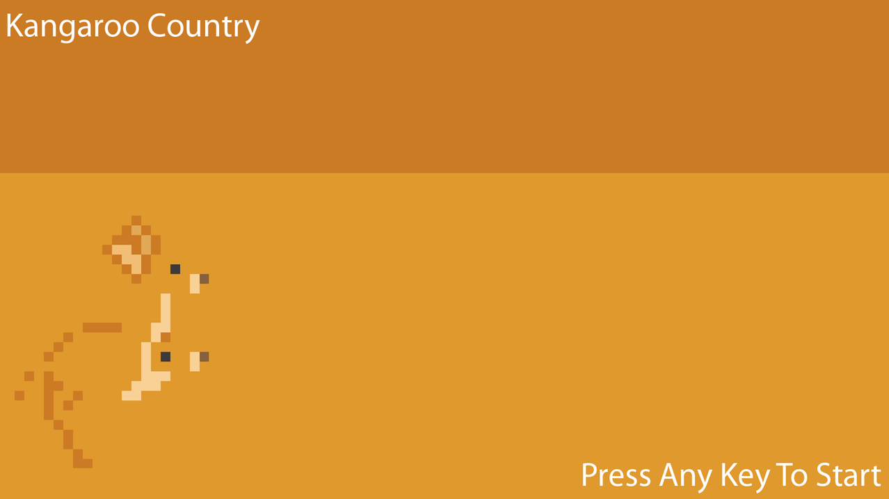
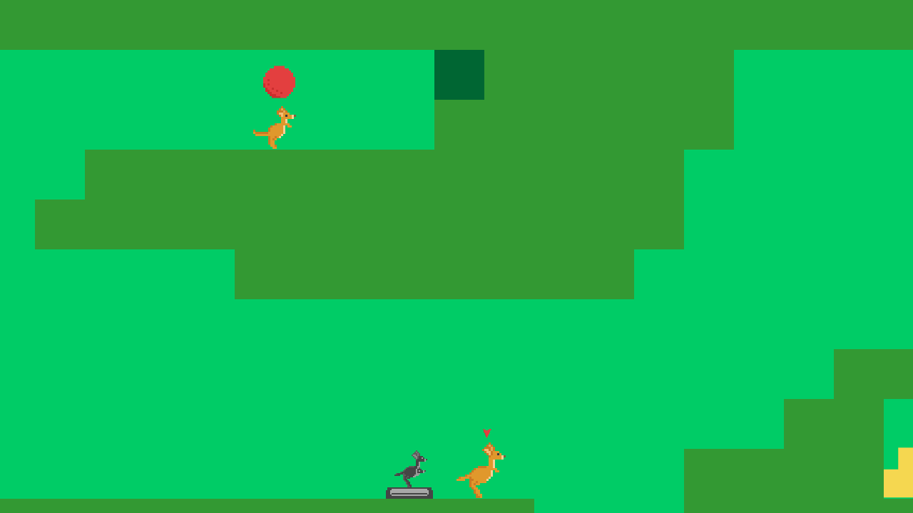
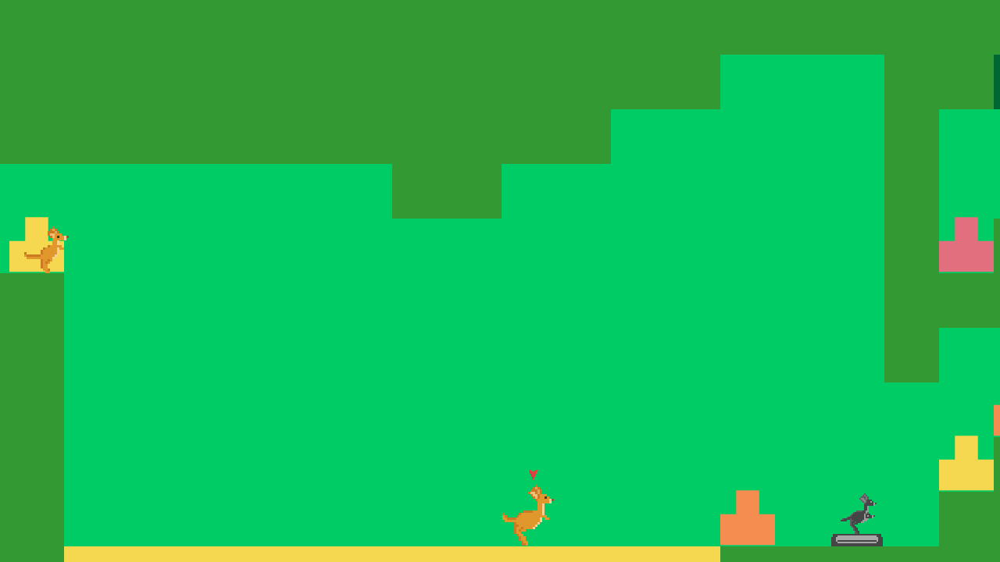

# Kangaroo Country

**Play as two kangaroos trying to traverse the outback**

*Kangaroo Country* is a 2D game built built in Actionscrpt 3 for Programming 12.  Game features two fully completed levels.  More levels can be easily added by using a Tile Map Editor.

## Downloads

Latest releases can be found [here](https://github.com/woofers/kangaroo-country/releases).

## Screenshots

